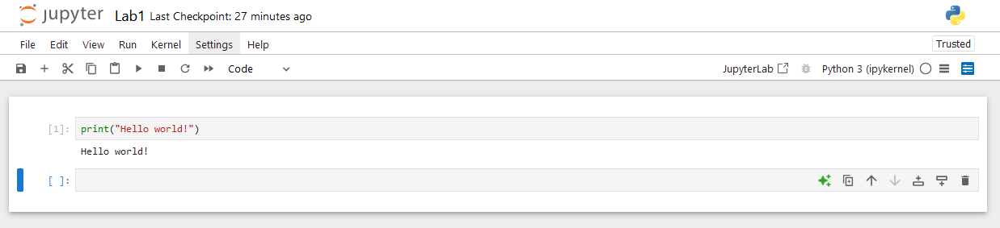
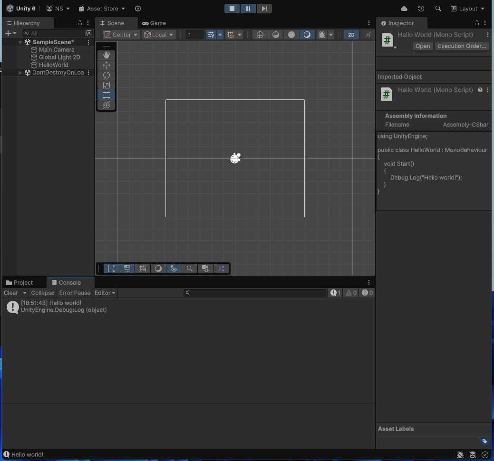

# АНАЛИЗ ДАННЫХ И ИСКУССТВЕННЫЙ ИНТЕЛЛЕКТ [in GameDev]
Отчет по лабораторной работе #1 выполнил(а):
- Шумов Никита Артёмович
- РИ232702
Отметка о выполнении заданий (заполняется студентом):

| Задание | Выполнение | Баллы |
| ------ | ------ | ------ |
| Задание 1 | * | 60 |
| Задание 2 | * | 20 |
| Задание 3 | * | 20 |

знак "*" - задание выполнено; знак "#" - задание не выполнено;

Работу проверили:
- к.т.н., доцент Денисов Д.В.
- к.э.н., доцент Панов М.А.
- ст. преп., Фадеев В.О.

[](https://nodesource.com/products/nsolid)

[](https://travis-ci.org/joemccann/dillinger)

Структура отчета

- Данные о работе: название работы, фио, группа, выполненные задания.
- Цель работы.
- Задание 1.
- Код реализации выполнения задания. Визуализация результатов выполнения (если применимо).
- Задание 2.
- Код реализации выполнения задания. Визуализация результатов выполнения (если применимо).
- Задание 3.
- Код реализации выполнения задания. Визуализация результатов выполнения (если применимо).
- Выводы.
- ✨Magic ✨

## Цель работы
Установить необходимое программное обеспечение, которое пригодится для создания интеллектуальных моделей на Python. Рассмотреть процесс установки игрового движка Unity для разработки игр.

## Задание 1

Написать программу Hello World на Python с запуском в Jupiter Notebook.

### Ход работы

Был скачан дистрибутив Anaconda. Через Anaconda Navigator запущен Jupyter Notebook. Создан и открыт файл `Lab1.ipynb`. В него вставлен код 
```python
print("Hello world")
```
Полученная программа была запущена.



## Задание 2

Написать программу Hello World на C# с запуском на Unity. 

### Ход работы

Был скачан Unity Hub и установлен Unity 6. Создан новый проект по шаблону `Universal 3D`. Добавлен в файлы проекта скрипт `HelloWorld.cs` с кодом:
```c#
using UnityEngine;

public class HelloWorld : MonoBehaviour
{
    void Start()
    {
        Debug.Log("Hello world!");
    }
}
```
В дереве сцены создан пустой объект, на него повешен созданный нами скрипт. Проект запущен, в консоли появилось сообщение 'Hello world'.



## Задание 3

Оформить отчет в виде документации на github (markdown-разметка).

### Ход работы

Был создан форк репозитория с шаблонным отчетом. Использовав в качестве примера шаблонный отчет, я оформил отчет о выполнении 1 практической работы. 

## Выводы
В ходе этой работы я проверил, корректно ли запускаются мои программы - Anaconda, JupyterLab, Unity Hub и Microsoft Visual Studio Code. Также я создал репозиторий с отчетом и оформил его с помощью разметки Markdown.

## Powered by

**BigDigital Team: Denisov | Fadeev | Panov**
